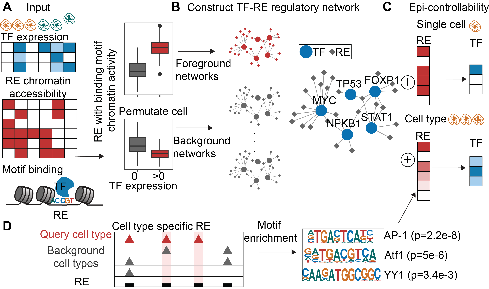

# EpiCon
## Introduction
EpiCon is a computational method, proposing an epigenetic controllability score to quantify the ability of TFs to open up closed chromatins for single cells and cell types, taking sc-multiome data as inputs. EpiCon first constructs a TF-RE regulatory network by integrating the single cell multiome input data and motif binding affinity using a correlation-based approach. The epi-controllability score for the single cell for a given TF is then defined as the weighted sum of regulatory strength of TF-RE pairs over REs where the weight is the cell specific chromatin accessibility of REs. For cell type-specific scores, we incorporate motif enrichment analysis, removing non-enriched motifs before network construction.
<div style="text-align: right">
  
</div>
EpiCon is validated using experimental datasets including chromatin immunoprecipitation sequencing (ChIP-seq) and TF knockdown data. EpiCon distinguished TFs even when they belong to the same family and share identical motifs. EpiCon discovers experimentally validated driver regulators. Our approach is broadly applicable to any sc-multiome data.

## Requirements
bedtools (conda install -c bioconda bedtools)

homer (conda install -c bioconda homer)

python packages: numpy, pandas, scipy, scikit-learn, scanpy, subprocess
## Install the packages
```sh
git clone https://github.com/Durenlab/EpiCon.git
```
## Download the provided data
```sh
Input_dir=/path/to/dir/
cd $Input_dir
wget --load-cookies /tmp/cookies.txt "https://docs.google.com/uc?export=download&confirm=$(wget --quiet --save-cookies /tmp/cookies.txt --keep-session-cookies --no-check-certificate 'https://docs.google.com/uc?export=download&id=1GJkUCGEcjYNacPQvADeYl3uO63_9OA33' -O- | sed -rn 's/.*confirm=([0-9A-Za-z_]+).*/\1\n/p')&id=1GJkUCGEcjYNacPQvADeYl3uO63_9OA33" -O provide_data.tar.gz && rm -rf /tmp/cookies.txt
tar -xzvf provide_data.tar.gz
```
## Run EpiCon 
Now we can run EpiCon in python
```python
from EpiCon import *
Input_dir='/data2/duren_lab/Kaya/CECI/H1/'
RNA_file='RNA.txt'
ATAC_file='ATAC.txt'
label_file='label.txt'
provide_dir='/data2/duren_lab/Kaya/CECI/H1/method/provide_data/'
code_dir='/data2/duren_lab/Kaya/CECI/code/'
genome='hg38'
outdir='/data2/duren_lab/Kaya/CECI/code/output'
N=200000
EpiCon(Input_dir,RNA_file,ATAC_file,label_file,provide_dir,code_dir,genome,outdir,N)
```

